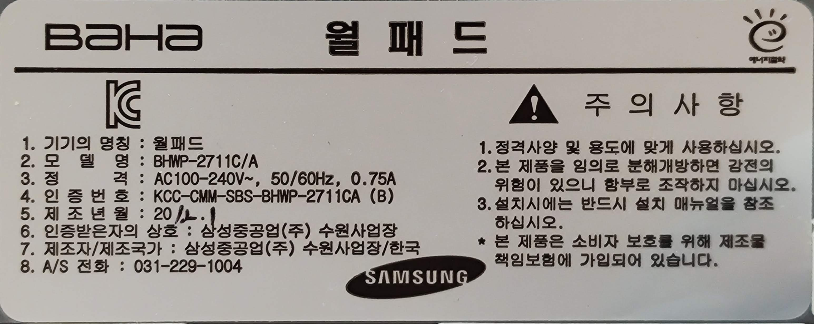
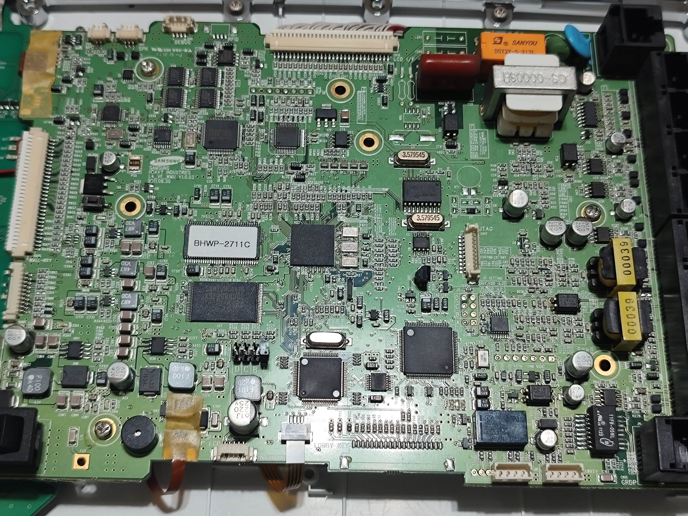

# BAHA 월패드 패킷 문서

빠른 이동: [프로토콜 개요](docs/protocol-overview.md) | [하드웨어](docs/hardware.md) | [거실 조명 `10 04`](docs/lighting-node-10-04.md) | [현관 / 일괄소등 `1F 0F`](docs/master-switch-node-1f0f.md) | [난방 `40 90`](docs/heater-node-40-90.md) | [ESPHome 구현 저장소](docs/esphome-external-component.md) | [참고 자료](reference/README.md)

삼성중공업 BAHA `BHWP-2711C/A` 월패드의 RS485 패킷을 실측 캡처와 능동 테스트로 정리한 문서 저장소다.

이 계열 월패드는 공개 자료가 거의 없어서, 실제 설치 환경에서 확인한 패킷 형식, 노드 역할, 제어 동작을 재사용 가능한 형태로 남기는 것이 목적이다.

## 빠른 요약

현재 정리된 주요 노드:

| 노드 | 용도 | 상태 |
| --- | --- | --- |
| `10 04` | 거실 4채널 조명 | 매핑 완료 |
| `10 06` | 타 설치 사례의 6채널 조명 | 패턴 확인 |
| `1F 0F` | 현관 / 일괄소등 스위치 상태 제어 | 실사용 기준으로 정리 완료 |
| `40 90` | 난방 상태 / 제어 | 매핑 완료 |

버스 설정:

| 항목 | 값 |
| --- | --- |
| UART | `9600 8N1` |
| 체크섬 | 페이로드 전체 XOR |
| 종료 바이트 | `00` |

조명 노드에 대해서는 다음 일반 규칙이 확인됐다.

- `10 xx` 계열 조명 노드는 `01 -> 81` 조회 / 상태 응답과 `02 02` 마스크 쓰기를 사용한다.
- `node_lo` 바이트는 해당 노드의 조명 채널 수와 일치한다.
- 상태 응답의 고정 capability 바이트도 같은 값을 사용한다.
- 단일 조명 제어는 `1, 2, 4, 8, ...` 식의 비트마스크로 표현된다.
- 켜기는 `<value_mask> = <channel_mask>`, 끄기는 `<value_mask> = 00` 이다.

## 문서 구성

- [docs/protocol-overview.md](docs/protocol-overview.md): 버스 프레이밍, 설정값, 확인된 노드 요약
- [docs/hardware.md](docs/hardware.md): 하드웨어 식별 정보와 캡처 환경 사진
- [docs/lighting-node-10-04.md](docs/lighting-node-10-04.md): 거실 조명 프로토콜
- [docs/master-switch-node-1f0f.md](docs/master-switch-node-1f0f.md): 현관 / 일괄소등 스위치 노드
- [docs/heater-node-40-90.md](docs/heater-node-40-90.md): 난방 프로토콜과 검증된 제어 패킷
- [docs/esphome-external-component.md](docs/esphome-external-component.md): 별도 ESPHome 구현 저장소 안내
- [reference/README.md](reference/README.md): 원본 조사 로그와 HTML 참고 자료

## 시험 하드웨어 한눈에 보기

- 월패드 모델: `BHWP-2711C/A`
- 라벨상 제조사: `삼성중공업(주) 수원사업장`
- 캡처 어댑터: `bitbus` `USB TO RS485`, 보드 코드 `MFA-02`
- PC 인식 USB 직렬 칩 계열: Silicon Labs `CP210x`

## 문서 범위에 대한 메모

- 이 문서는 실제 1개 설치 환경에서 검증한 결과를 바탕으로 한다. 유사한 BAHA / 삼성중공업 월패드라도 펌웨어, 배선, 연결된 하위 시스템에 따라 차이가 있을 수 있다.
- 본 저장소는 실측된 동작을 정리한 것이며, 제조사 공식 서비스 문서는 아니다.
- ESPHome 구현은 별도 저장소 [`esphome-samsung-baha-rs485`](https://github.com/mahlernim/esphome-samsung-baha-rs485) 로 분리함. 이 저장소는 패킷 해석과 실측 근거를 중심으로 유지함.

## 다음 읽을 문서

- 전체 버스 구조부터 보려면 [docs/protocol-overview.md](docs/protocol-overview.md)
- 하드웨어 식별과 사진부터 보려면 [docs/hardware.md](docs/hardware.md)
- 바로 제어 패킷을 보려면 [거실 조명](docs/lighting-node-10-04.md), [현관 / 일괄소등](docs/master-switch-node-1f0f.md), [난방](docs/heater-node-40-90.md)
- ESPHome 구현을 보려면 [ESPHome 구현 저장소 안내](docs/esphome-external-component.md)
