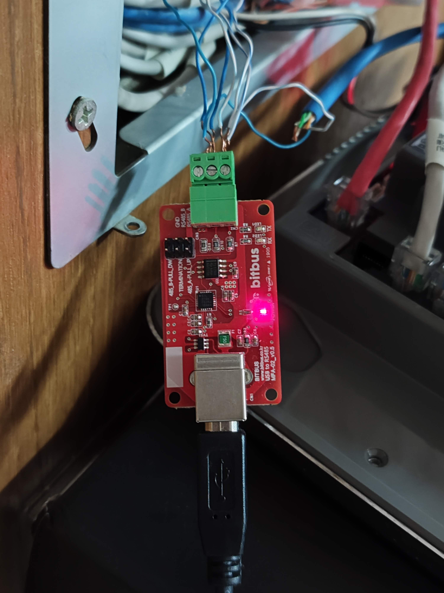
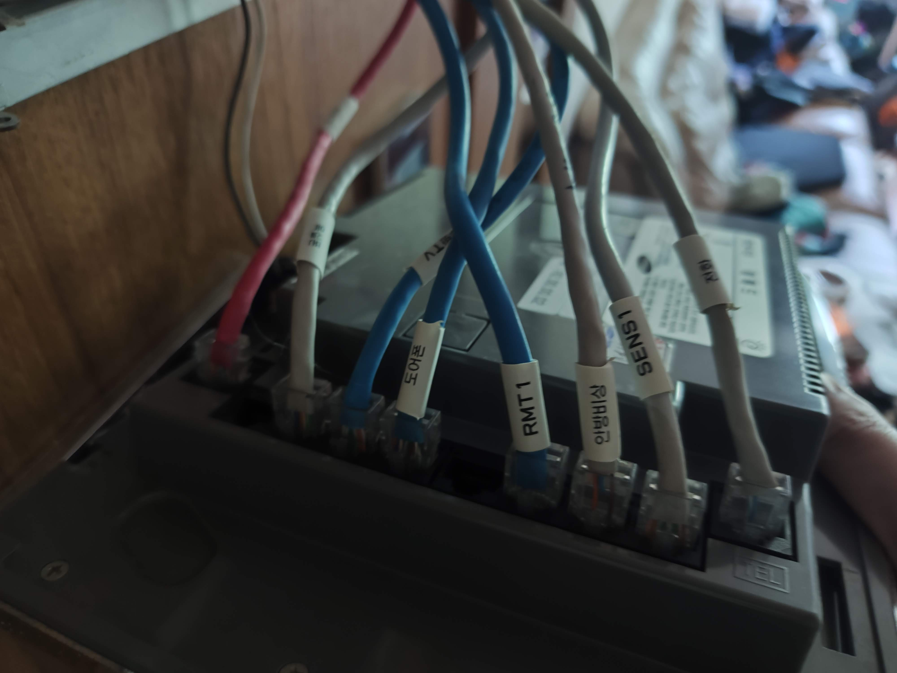

# 하드웨어 식별 정보

상위 문서: [README](../README.md)  
바로 가기: [프로토콜 개요](protocol-overview.md) | [거실 조명 `10 04`](lighting-node-10-04.md) | [현관 / 일괄소등 `1F 0F`](master-switch-node-1f0f.md) | [난방 `40 90`](heater-node-40-90.md) | [참고 자료](../reference/README.md)

## 월패드

대상 월패드는 삼성중공업이 제조한 BAHA `BHWP-2711C/A` 모델이다.

### 라벨에서 직접 확인된 정보

| 항목 | 값 |
| --- | --- |
| 브랜드 | `BAHA` |
| 기기 종류 | `월패드` |
| 모델명 | `BHWP-2711C/A` |
| 인증 번호 | `KCC-CMM-SBS-BHWP-2711CA (B)` |
| 정격 입력 | `AC100-240V~, 50/60Hz, 0.75A` |
| 인증 받은 자 / 상호 | `삼성중공업(주) 수원사업장` |
| 제조국가 | `한국` |
| A/S 전화 | `031-229-1004` |

외부 라벨의 제조년월 필드는 사진상 필기가 완전히 읽히지 않아 의도적으로 제외했다.

## 메인 PCB

PCB에서 읽을 수 있는 표기:

| 항목 | 값 |
| --- | --- |
| PCB 스티커 | `BHWP-2711C` |
| PCB 제조사 표기 | `SAMSUNG HEAVY INDUSTRIES` |
| PCB 리비전 문자열 | `L4 VE_WMU V1.0.03` |
| PCB 날짜 표기 | `2011.08.30` |
| 실크 표기 예시 | `DEBUG`, `RFID`, `RFM`, `JTAG`, `LCD`, `LOBBY KEY`, `SETTING`, `SECURITY`, `GRDPL` |
| 사진에서 보이는 릴레이 예시 | `SANYOU DSY2Y-S-2121` |

## 캡처 어댑터

패킷 캡처에는 `bitbus`의 `USB TO RS485` 보드를 사용했다.

사진으로 직접 확인된 정보:

| 항목 | 값 |
| --- | --- |
| 보드 브랜딩 | `bitbus` |
| 보드 표기 | `USB TO RS485` |
| 보드 코드 | `MFA-02` |
| PCB 리비전 | `V0.5` |
| USB 커넥터 | `USB-C` |
| RS485 인터페이스 | 3핀 스크루 터미널 |

PC에서 확인한 사항:

- Windows에서 이 어댑터를 Silicon Labs `CP210x USB to UART Bridge`로 인식했다.

공개 문서에서는 다음처럼 적는 편이 무난하다.

- `bitbus MFA-02` USB-RS485 어댑터
- 호스트 인식 기준 `CP210x` 계열 USB-시리얼 브리지

## 배선 / 캡처 위치

캡처용 탭은 월패드 내부 공간에서 구성했다. 월패드는 전원이 들어온 상태였고, RS485 스크루 터미널에 꼬임선이 연결된 상태로 측정했다.

## 관련 문서

- 전체 버스 구조: [protocol-overview.md](protocol-overview.md)
- 거실 조명 프로토콜: [lighting-node-10-04.md](lighting-node-10-04.md)
- 난방 프로토콜: [heater-node-40-90.md](heater-node-40-90.md)
