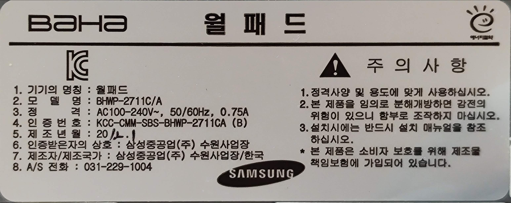
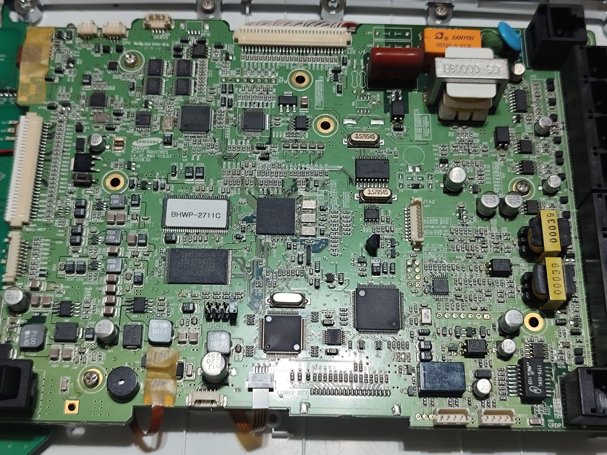
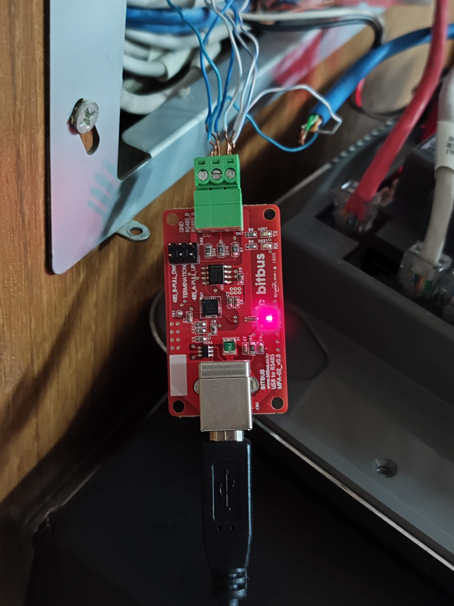
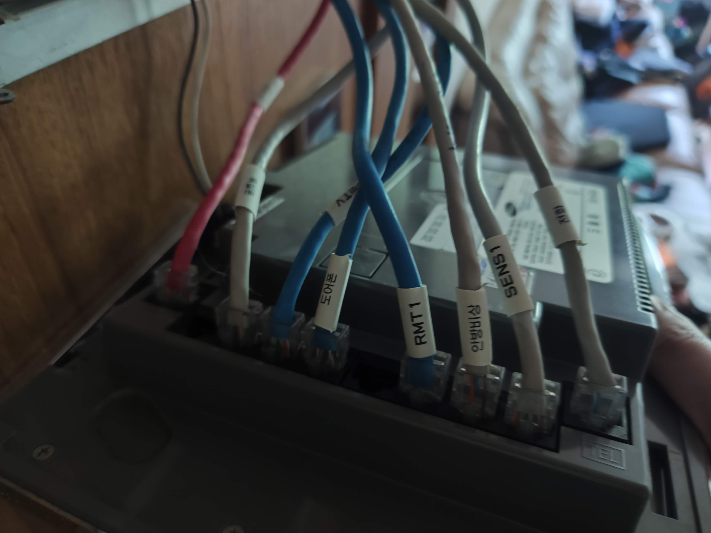

# 하드웨어 식별 정보

상위 문서: [README](../README.md)  
바로 가기: [프로토콜 개요](protocol-overview.md) | [거실 조명 `10 04`](lighting-node-10-04.md) | [현관 / 일괄소등 `1F 0F`](master-switch-node-1f0f.md) | [난방 `40 90`](heater-node-40-90.md) | [참고 자료](../reference/README.md)

## 월패드

측정한 월패드는 삼성중공업의 BAHA `BHWP-2711C/A`다. 이 문서는 사진과 PC 인식 결과를 정리하며, 다른 BHWP 모델과 사업 이력은 [모델 식별표](model-family.md)에서 다룬다.

### 라벨 표기

| 항목 | 값 |
| --- | --- |
| 브랜드 | `BAHA` |
| 기기 종류 | `월패드` |
| 모델명 | `BHWP-2711C/A` |
| 인증 번호 | `KCC-CMM-SBS-BHWP-2711CA (B)` |
| 정격 입력 | `AC100-240V~, 50/60Hz, 0.75A` |
| 인증 받은 자 / 상호 | `삼성중공업(주) 수원사업장` |
| 제조국가 | `한국` |
| A/S 전화 | `031-229-1004` |

제조년월은 필기를 판독하기 어려워 제외했다. A/S 전화는 라벨에 적힌 당시 정보다.

## 메인 PCB

사진에서 읽은 PCB 표기:

| 항목 | 값 |
| --- | --- |
| PCB 스티커 | `BHWP-2711C` |
| PCB 제조사 표기 | `SAMSUNG HEAVY INDUSTRIES` |
| PCB 리비전 문자열 | `L4 VE_WMU V1.0.03` |
| PCB 날짜 표기 | `2011.08.30` |
| 실크 표기 예시 | `DEBUG`, `RFID`, `RFM`, `JTAG`, `LCD`, `LOBBY KEY`, `SETTING`, `SECURITY`, `GRDPL` |
| 사진에서 보이는 릴레이 예시 | `SANYOU DSY2Y-S-2121` |

## 캡처 어댑터

패킷 캡처에는 `bitbus MFA-02` USB-RS485 어댑터를 사용했다.

사진에서 확인한 정보:

| 항목 | 값 |
| --- | --- |
| 보드 브랜딩 | `bitbus` |
| 보드 표기 | `USB TO RS485` |
| 보드 코드 | `MFA-02` |
| PCB 리비전 | `V0.5` |
| USB 커넥터 | `USB-C` |
| RS485 인터페이스 | 3핀 스크루 터미널 |

Windows에서는 Silicon Labs `CP210x USB to UART Bridge`로 인식됐다. 가상 COM 포트 드라이버는 [Silicon Labs 공식 다운로드](../reference/sources.md#s21)에서 찾을 수 있다. 이 인식명으로 확인되는 것은 USB 브리지 계열이며, 보드의 절연 여부·RS485 트랜시버·방향 제어 회로는 미확인이다.

## 배선 / 캡처 위치

월패드 내부에서 RS485 스크루 터미널에 꼬임선을 연결해 측정했다. 사진은 당시 캡처 위치를 기록한 것으로, 다른 장비의 핀 배치나 배선 지침으로 사용할 수 없다.

## 전기적 연결의 참고 자료

TI의 RS485 설계 지침은 짧은 분기, 케이블 양 끝의 종단, 반이중 통신에서 한 번에 하나의 송신기만 구동하는 원칙을 설명한다. 기존 월패드에 적용하려면 현재 종단·바이어스·절연 구성을 먼저 확인해야 한다. [S20](../reference/sources.md#s20)

`BHWP-2711C/A`의 서비스 핀맵, 단자 전압, 트랜시버와 모델 접미사 규칙은 아직 확보하지 못했다. 일반 RS485 자료로 이 값이나 UART 설정을 정할 수는 없다. [미확인 사항](open-questions.md)

## 관련 문서

- 전체 버스 구조: [protocol-overview.md](protocol-overview.md)
- 거실 조명 프로토콜: [lighting-node-10-04.md](lighting-node-10-04.md)
- 난방 프로토콜: [heater-node-40-90.md](heater-node-40-90.md)
